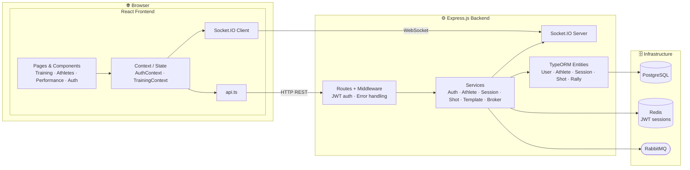

# Application Component Diagram

```mermaid
graph LR
    subgraph Browser["🌐 Browser"]
        subgraph Frontend["React Frontend"]
            UI["Pages & Components<br/>Training · Athletes · Performance · Auth"]
            Ctx["Context / State<br/>AuthContext · TrainingContext"]
            Api["api.ts"]
            Ws["Socket.IO Client"]
        end
    end

    subgraph Server["⚙️ Express.js Backend"]
        REST["Routes + Middleware<br/>JWT auth · Error handling"]
        Logic["Services<br/>Auth · Athlete · Session · Shot · Template · Broker"]
        WsServer["Socket.IO Server"]
        Models["TypeORM Entities<br/>User · Athlete · Session · Shot · Rally"]
    end

    subgraph Infra["🗄️ Infrastructure"]
        PG[("PostgreSQL")]
        Redis[("Redis<br/>JWT sessions")]
        RMQ(["RabbitMQ"])
    end

    UI --> Ctx
    Ctx --> Api & Ws
    Api -->|"HTTP REST"| REST
    Ws -->|"WebSocket"| WsServer
    REST --> Logic
    Logic --> Models & WsServer
    Models --> PG
    Logic --> Redis & RMQ
```
